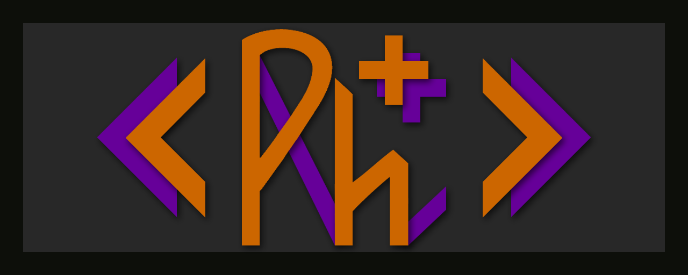

<h1 align="center">Physcis Engine</h1>
<h4 align="center">Not Actually a Physics Engine</h4>

<h3>Description</h3>
Physcis Engine is a 3D game engine, using GLFW for OpenGL. 
It's written by me (Adam Wallberg), and is only a small hobby project. 

<h3>Implemented Features</h3> 
  - Premake5 project setup.
  - Component based input system. (Not complete yet.)
  - JSON loading and parsing using modern json. <a href="https://github.com/nlohmann/json">github.com/nlohmann/json</a>
  - Window creating using GLFW.
  - Memory tracking and leak detection.
  - Lightweight math library. 2D, 3D, 4D vectors, 4x4 matrices, and basic math operations.
  - Basic rendering and shading.
  - Lots of bugs.
  - Parsing of OBJ, and BMP files.

<h3>Planned Features</h3>
  - Deferred rendering with some fancy postFX. 'Tis my forte.
  - Some sort of python scripting.
  - Event based communication. (Implemented, but not representable)

<h3>Setup</h3>
Heads up: the project can probably only compile using visual studio community 2015, mostly because of the json library.

  1. Download PhyscisMath from <a href="https://github.com/AdamWallberg/PhyscisMath">here</a>, and add its path in physcismath.lua.
    All other dependencies are included in the project. 
  2. Run "generate_project_files.ps1" with powershell. If it complains about the execution policy,
     set it to unrestricted. <a href="https://technet.microsoft.com/en-us/library/ee176961.aspx">check this out.</a>
  3. Tadaa! Solution files! :D

<h3>External libraries</h3>
- PhyscisMath - https://github.com/AdamWallberg/PhyscisMath
- GLFW - http://www.glfw.org/
- GLEW - http://glew.sourceforge.net/
- (Not in use at the moment) FBX - http://usa.autodesk.com/adsk/servlet/pc/item?siteID=123112&id=26012646
- JSON - https://github.com/nlohmann/json
